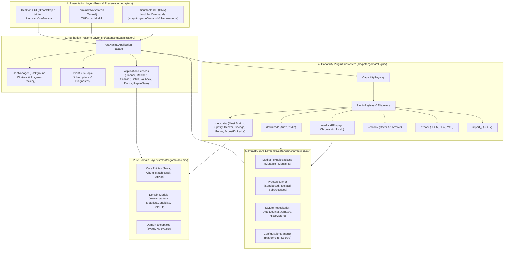

# ARCHITECTURE.md — PataNgoma System Architecture

This document defines the canonical architectural specification, structural layer boundaries, domain concepts, capability plugin taxonomy, frontend presentation models, and operational invariants for the **PataNgoma AudioTagger** platform.

---

## 1. Canonical Architectural Statement

> **PataNgoma is a framework-independent application platform for managing, identifying, enriching, transforming, and maintaining audio libraries.**
>
> Its domain model and application services define the product's behavior independently of presentation technology.
>
> PataNgoma exposes that platform through three independent frontends: a `ttkbootstrap` desktop GUI, a `Textual` terminal UI, and a scriptable CLI. These frontends are peers and presentation adapters; none owns business logic or directly controls provider implementations.
>
> External capabilities are provided through a plugin architecture encompassing metadata providers, download backends, media tools, artwork providers, importers, exporters, and other extensible capabilities.
>
> Infrastructure concerns—including persistence, filesystem access, networking, subprocess execution, caching, configuration, and secrets—are isolated behind application-facing contracts.
>
> The resulting architecture allows PataNgoma to evolve its interfaces, providers, backends, and infrastructure independently while maintaining one coherent application model.

---

## 2. 5-Layer Platform Topology



---

## 3. Structural Layer Responsibilities & Boundaries

### 3.1 Domain Layer (`patangoma.domain`)
The domain layer represents pure, immutable business concepts and data transfer objects. It has **zero dependencies** on UI libraries, external network APIs, databases, or subprocesses.
- **`TrackMetadata`**: Complete audio tag state (title, artist, album, album_artist, year, genre, track/disc numbers, ISRC, MusicBrainz IDs, duration, bitrate, audio properties).
- **`MetadataCandidate`**: Normalized metadata record produced by external metadata providers.
- **`TagPlan` & `FieldDiff`**: Deterministic changelog detailing old value, new value, field status (`ADDED`, `MODIFIED`, `REMOVED`, `UNCHANGED`), and match confidence.
- **`MatchResult` & `ScoreBreakdown`**: Deterministic weighted score breakdown (title, artist, duration, track number, popularity) with explainable confidence levels (`EXACT`, `HIGH`, `MEDIUM`, `LOW`, `NO_MATCH`).
- **`JobDescriptor` & `AuditEvent`**: First-class tracking for async tasks and library mutation history.

### 3.2 Application Platform Layer (`patangoma.application`)
Orchestrates high-level business workflows, job lifecycles, and event distribution.
- **`PataNgomaApplication`**: Central platform facade exposing clean, typed methods (`scan_library`, `identify_track`, `create_tag_plan`, `apply_tag_plan`, `rollback`, `list_jobs`, `cancel_job`, `run_diagnostics`).
- **`JobManager`**: Thread-safe async job scheduler, status reporter, and cooperative task canceller.
- **`EventBus`**: Publish-subscribe bus decoupling long-running operational telemetry from presentation views.
- **Application Services (`patangoma.services`)**: `LibraryScanner`, `MatchingEngine`, `PlanEngine`, `BatchService`, `AuditJournal`, `GenreNormalizer`, `ReplayGainService`, `QualityInspector`, `MetadataReasoner`.

### 3.3 Capability Plugin Subsystem (`patangoma.plugins`)
Pluggable extensions implementing typed capability contracts without concrete coupling to the application core:
- **`CapabilityRegistry`**: Routes capability queries to available plugins:
  - `get_metadata_provider(name)` / `list_metadata_providers()`
  - `get_download_backend(name)` / `list_download_backends()`
  - `get_media_tool(name)` / `list_media_tools()`
  - `get_artwork_provider(name)` / `list_artwork_providers()`
  - `get_lyrics_provider(name)` / `list_lyrics_providers()`
  - `get_exporter(format_name)` / `list_exporters()`
  - `get_importer(format_name)` / `list_importers()`
- **Capability Packages**:
  - `metadata/`: MusicBrainz, Spotify, Deezer, Discogs, iTunes, AcoustID, Lyrics.
  - `download/`: Aria2, yt-dlp.
  - `media/`: FFmpeg, Chromaprint (`fpcalc`).
  - `artwork/`: Cover Art Archive.
  - `export/`: JSON, CSV, M3U8.
  - `import_/`: JSON.

### 3.4 Infrastructure Layer (`patangoma.infrastructure`)
Encapsulates all I/O, database access, configuration, and external process execution behind standard ports:
- **`MediaFileAudioBackend`**: Wraps mutagen and mediafile for safe tag reading/writing across MP3, FLAC, M4A, OGG, OPUS, AIFF, WAV.
- **`ProcessRunner`**: Safely locates binaries (`ffmpeg`, `fpcalc`, `aria2c`, `yt-dlp`), executes processes with timeouts, and parses stdout/stderr.
- **`SQLiteAuditRepository`**: ACID-compliant transaction snapshots enabling rollback and audit trail reporting.
- **`ConfigurationManager`**: Multi-tier configuration loaded from CLI flags, environment variables, `.env`, and OS-standard config directories (`platformdirs`).

### 3.5 Presentation Layer (`patangoma.frontends`)
Three peer frontends consuming `PataNgomaApplication`:
1. **Desktop GUI (`patangoma.frontends.gui`)**:
   - `ttkbootstrap` / `tkinter` desktop workstation.
   - Powered by headless ViewModels (`LibraryViewModel`, `TagEditorViewModel`, `BatchViewModel`, `RollbackViewModel`, `PluginsViewModel`, `JobMonitorViewModel`, `DiagnosticsViewModel`) for automated headless CI testing.
2. **Terminal UI (`patangoma.frontends.tui`)**:
   - `Textual` full-screen interactive TUI workstation (`PataNgomaTUIApp`, `TUIScreenModel`).
3. **Scriptable CLI (`patangoma.frontends.cli`)**:
   - Modular Click command hierarchy (`scan`, `match`, `plan`, `apply`, `rollback`, `library`, `audio`, `doctor`, `plugins`, `jobs`, `session`).

---

## 4. The Safe Mutation Lifecycle

All file tagging and metadata alterations follow an atomic, reversible lifecycle:

```text
┌──────────────┐     ┌──────────────┐     ┌──────────────┐     ┌──────────────┐
│  1. INSPECT  │ ──> │  2. SEARCH   │ ──> │   3. MATCH   │ ──> │   4. PLAN    │
│ Read audio   │     │ Query plugins│     │ Deterministic│     │ Generate tag │
│ metadata     │     │ & normalize  │     │ score/conf   │     │ diff changes │
└──────────────┘     └──────────────┘     └──────────────┘     └──────────────┘
                                                                       │
┌──────────────┐     ┌──────────────┐     ┌──────────────┐             │
│  7. VERIFY   │ <── │   6. APPLY   │ <── │  5. BACKUP   │ <───────────┘
│ Integrity &  │     │ Atomic tag   │     │ Snapshot to  │
│ checksum check     │ mutation     │     │ SQLite audit │
└──────────────┘     └──────────────┘     └──────────────┘
```

---

## 5. Architectural Invariants Enforced in CI

The test suite enforces layer boundaries programmatically in [`tests/architecture/test_layer_invariants.py`](file:///home/BillGates/code/PataNgoma-AudioTagger-tool/tests/architecture/test_layer_invariants.py):
1. **Domain Layer Independence**: Zero imports of UI libraries (`click`, `rich`, `InquirerPy`, `textual`, `ttkbootstrap`, `tkinter`).
2. **Application Layer Independence**: Zero UI imports and zero direct imports of concrete plugin modules.
3. **No `sys.exit()` in Platform**: Zero `sys.exit()` calls in `domain/`, `application/`, or `plugins/`.
4. **Reversible Mutations**: All mutations must record an `AuditRecord` with complete pre-mutation snapshots.
5. **Headless Execution**: The entire platform core can be instantiated and executed in headless environments without displays or terminals.
