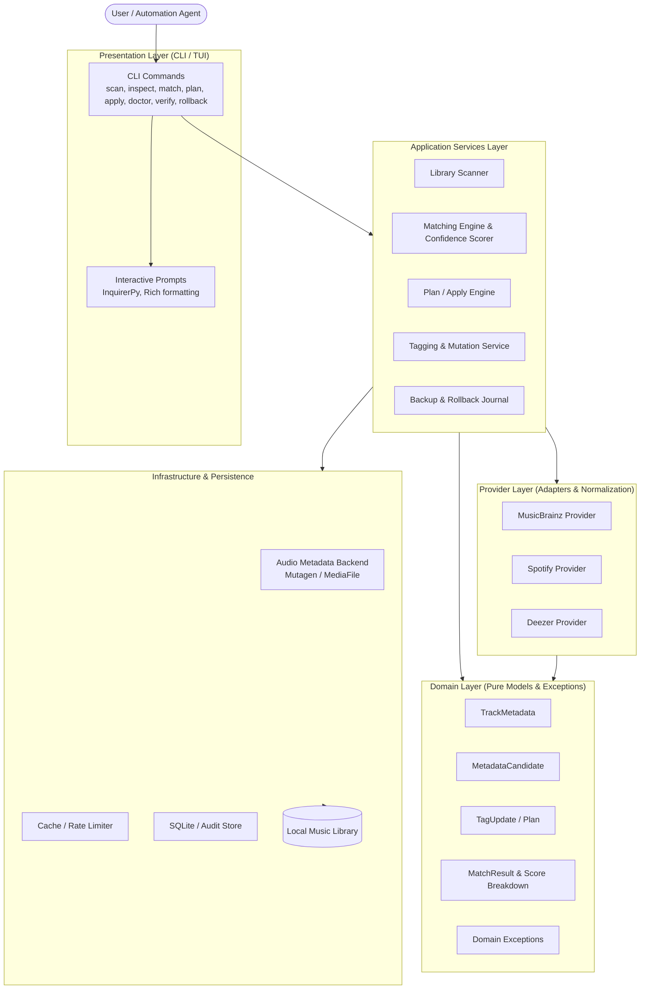

# ARCHITECTURE.md — PataNgoma System Architecture

This document defines the architectural boundaries, domain concepts, data flow, and design invariants for the **PataNgoma AudioTagger** platform.

---

## 1. System Architecture Diagram



---

## 2. Layer Responsibilities & Boundaries

### 2.1 Domain Layer (`patangoma.domain`)
The domain layer represents pure business concepts and is completely independent of external APIs, databases, or terminal interfaces.

- **`TrackMetadata`**: Canonical representation of audio tags from an audio file (e.g. title, artist, album, album artist, year, track number, disc, genre, isrc, mb_ids, artwork).
- **`MetadataCandidate`**: Standardized candidate record returned by external metadata providers.
- **`MatchResult`**: Score breakdown (title similarity, artist similarity, duration difference, track index) producing a confidence level (`EXACT`, `HIGH`, `MEDIUM`, `LOW`, `NO_MATCH`).
- **`TagPlan`**: Explicit changeset showing original vs. proposed tags with provider provenance and safety checks.
- **`AuditRecord`**: Historical record of changes applied, backing up previous tags and enabling atomic rollback.

### 2.2 Provider Layer (`patangoma.providers`)
External metadata services must adhere to the `MetadataProvider` protocol:

```python
from typing import Protocol, Sequence
from patangoma.domain.models import MetadataCandidate, QueryParameters


class MetadataProvider(Protocol):
    @property
    def name(self) -> str: ...

    def search_tracks(self, query: QueryParameters) -> Sequence[MetadataCandidate]: ...

    def get_track_by_id(self, track_id: str) -> MetadataCandidate | None: ...
```

Each provider adapter is responsible for:
- API authentication and rate-limiting
- Error translation (e.g., mapping network timeouts to `ProviderUnavailableError`)
- Normalizing raw provider payloads into standard `MetadataCandidate` instances

### 2.3 Application Services Layer (`patangoma.services`)
Orchestrates workflows without coupling to Click or terminal prompts:
- **`LibraryScanner`**: Recursively discovers audio files, detects missing tags, corrupt headers, and duplicates.
- **`MatchingEngine`**: Computes deterministic similarity scores between `TrackMetadata` and `MetadataCandidate`.
- **`PlanEngine`**: Compares current file metadata against chosen candidates to produce a deterministic `TagPlan`.
- **`TaggingService`**: Applies mutations, creates pre-mutation backups, verifies written tags, and logs audit events.
- **`RollbackService`**: Reads audit journals and restores prior file states reliably.

### 2.4 Presentation Layer (`patangoma.cli`)
- Interacts with users via Click commands and interactive prompts (`InquirerPy`, `Rich`).
- Handles terminal formatting, tables, color output, and progress bars.
- Translates service outcomes and domain errors into standard CLI exits:
  - `0`: Success
  - `1`: General error / invalid parameters
  - `2`: Audio file corruption / unsupported format
  - `3`: Provider failure / network error

---

## 3. The Plan / Apply & Safe Mutation Workflow

To prevent accidental data loss or silent library corruption, mutations follow a strict lifecycle:

```text
1. INSPECT   ──> Extract existing TrackMetadata
2. SEARCH    ──> Query Providers & normalize candidates
3. MATCH     ──> Calculate confidence score & explanation
4. PLAN      ──> Generate TagPlan (original vs proposed tags)
5. REVIEW    ──> User review or automated threshold check
6. BACKUP    ──> Record pre-mutation state in Audit Journal
7. APPLY     ──> Write tags to audio file
8. VERIFY    ──> Re-read file to verify tags & file integrity
```

---

## 4. Architectural Invariants

1. **No UI in Domain/Services**: Never import `click`, `rich`, `InquirerPy`, or `imgcat` in domain models, providers, or application services.
2. **No `sys.exit()` in Business Logic**: Always raise typed domain exceptions. Only the CLI entry point may decide to exit the process.
3. **Deterministic Output**: For identical input queries and provider responses, matching algorithms must produce identical scores and explanations.
