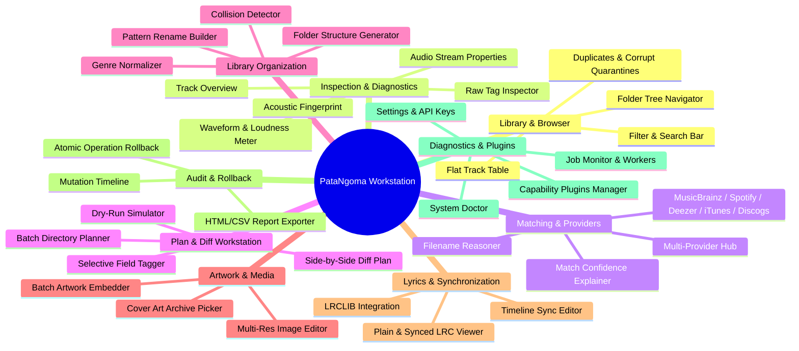

# SCREEN_CATALOGUE.md — PataNgoma Frontend Information Architecture

This document defines the **120–150 Screen Catalogue & Information Architecture** for the **PataNgoma AudioTagger** platform across the Desktop GUI (`ttkbootstrap`), Terminal TUI (`Textual`), and CLI workflows.

---

## 1. Architectural Relationship

As established in Section 51 of the Architecture Rewrite Specification:

```text
ARCHITECTURE
     ↓
APPLICATION CAPABILITIES (PataNgomaApplication, PluginRegistry, CapabilityRegistry)
     ↓
USE CASES (Identification, Tag Planning, Batch Operations, Rollback, Audio Diagnostics)
     ↓
FRONTEND INFORMATION ARCHITECTURE
     ↓
SCREEN CATALOGUE (Screens 001–150)
     ↓
WIREFRAMES & VIEWMODELS
     ↓
FRONTEND IMPLEMENTATION
```

---

## 2. Global Information Architecture & Navigation Topology



---

## 3. Comprehensive Screen Catalogue (Screens 001 – 150)

### Module 1: Library & File System Navigation (Screens 001–015)
| Screen ID | Screen Name | Presentation Targets | Application Capability / ViewModel | Description |
| :--- | :--- | :--- | :--- | :--- |
| **SCR-001** | Root Library Browser | GUI, TUI | `LibraryViewModel.load_directory` | Top-level entry browsing root music directories. |
| **SCR-002** | Folder Tree Navigator | GUI, TUI | `LibraryViewModel` | Recursive folder directory tree with collapse/expand. |
| **SCR-003** | Flat Track Table | GUI, TUI, CLI | `LibraryViewModel.filtered_tracks` | Sortable multi-column table of audio tracks. |
| **SCR-004** | Missing Metadata Filter | GUI, TUI | `LibraryScanner` | Quick-filter view isolating tracks with missing tags. |
| **SCR-005** | Unmatched Tracks Queue | GUI, TUI | `BatchViewModel` | Staging queue for tracks pending identification. |
| **SCR-006** | Duplicate Track Inspector | GUI, TUI, CLI | `DuplicateDetector` | Grouped view of detected duplicate files. |
| **SCR-007** | Corrupt File Quarantine | GUI, TUI, CLI | `FileValidator` | Lists unreadable files and invalid audio headers. |
| **SCR-008** | Search & Query Filter Bar | GUI, TUI | `LibraryViewModel.filter_query` | Real-time text search across title, artist, album, genre. |
| **SCR-009** | Sort Order Configurator | GUI, TUI | `LibraryViewModel` | Configures primary and secondary multi-column sorting. |
| **SCR-010** | Column Layout Customizer | GUI | `LibraryViewModel` | Toggle visibility and ordering of metadata columns. |
| **SCR-011** | Path Bookmarks & Recents | GUI, TUI | `ConfigurationManager` | Quick-access list of pinned library locations. |
| **SCR-012** | Multi-Selection Drawer | GUI, TUI | `BatchViewModel` | Floating panel displaying currently selected batch tracks. |
| **SCR-013** | Context Action Menu | GUI, TUI | `PataNgomaApplication` | Right-click/shortcut popup for inspect, tag, rename, delete. |
| **SCR-014** | Fast Quick-Inspect Popup | GUI, TUI | `PataNgomaApplication.read_metadata` | Lightweight hovering overlay showing primary track tags. |
| **SCR-015** | Breadcrumb Navigation Bar | GUI, TUI | `LibraryViewModel` | Clickable hierarchy trail of the active directory path. |

---

### Module 2: Track Inspection & Diagnostics (Screens 016–030)
| Screen ID | Screen Name | Presentation Targets | Application Capability / ViewModel | Description |
| :--- | :--- | :--- | :--- | :--- |
| **SCR-016** | Track Overview Card | GUI, TUI, CLI | `TagEditorViewModel` | Primary summary card of metadata and album art. |
| **SCR-017** | Full Tag Inspector | GUI, TUI, CLI | `MediaFileAudioBackend` | Complete key-value grid of ID3, Vorbis, or MP4 tags. |
| **SCR-018** | Technical Stream Properties | GUI, TUI, CLI | `QualityInspector` | Displays bitrate, sample rate, channels, codec, duration. |
| **SCR-019** | Embedded Artwork Viewer | GUI, TUI | `ArtworkService` | Full-resolution image preview with zoom and dimensions. |
| **SCR-020** | Lyrics Viewer (Plain/LRC) | GUI, TUI, CLI | `LyricsPlugin` | Displays embedded and online synchronized LRC lyrics. |
| **SCR-021** | ReplayGain & Loudness Meter | GUI, TUI, CLI | `ReplayGainService` | Shows track/album peak, gain (dB), and loudness curve. |
| **SCR-022** | Chromaprint / fpcalc View | GUI, TUI, CLI | `ChromaprintMediaPlugin` | Displays computed fingerprint string and duration hash. |
| **SCR-023** | Transcode Anomaly Report | GUI, TUI, CLI | `QualityInspector` | Flags lossy-to-lossless upconversions and clipped audio. |
| **SCR-024** | Cue Sheet Split Viewer | GUI, TUI, CLI | `PlaylistService` | Previews individual sub-tracks defined in `.cue` files. |
| **SCR-025** | File Header Hex Inspector | GUI | `FileValidator` | Inspects magic bytes, container atoms, and header ID. |
| **SCR-026** | File Checksum & Hash Matrix | GUI, TUI, CLI | `FileValidator` | Calculates and compares MD5, SHA-1, and SHA-256 hashes. |
| **SCR-027** | Permissions & I/O Status | GUI, TUI | `ProcessRunner` | Displays file ownership, write permissions, and lock state. |
| **SCR-028** | Audio Waveform Visualizer | GUI, TUI | `MediaFileAudioBackend` | Renders mini-waveform showing peak amplitude profile. |
| **SCR-029** | Container Atom Tree | GUI | `MediaFileAudioBackend` | Hierarchical tree of MP4 atoms or FLAC metadata blocks. |
| **SCR-030** | Tag Version Comparison | GUI | `TagEditorViewModel` | Compares ID3v1 vs ID3v2.3 vs ID3v2.4 tags in same file. |

---

### Module 3: Provider Search & Candidate Matching (Screens 031–045)
| Screen ID | Screen Name | Presentation Targets | Application Capability / ViewModel | Description |
| :--- | :--- | :--- | :--- | :--- |
| **SCR-031** | Multi-Provider Search Hub | GUI, TUI, CLI | `MetadataAggregator` | Queries all 7 providers concurrently and ranks results. |
| **SCR-032** | MusicBrainz Candidate List | GUI, TUI, CLI | `MusicBrainzPlugin` | Displays MusicBrainz release and recording candidates. |
| **SCR-033** | Spotify Candidate List | GUI, TUI, CLI | `SpotifyPlugin` | Displays Spotify track matches and streaming popularity. |
| **SCR-034** | Deezer Candidate List | GUI, TUI, CLI | `DeezerPlugin` | Displays Deezer metadata matches and preview tracks. |
| **SCR-035** | Discogs Release Inspector | GUI, TUI, CLI | `DiscogsPlugin` | Displays vinyl, CD, and international release pressings. |
| **SCR-036** | Apple iTunes Candidate List | GUI, TUI, CLI | `ITunesPlugin` | Fast search with high-resolution store cover artwork. |
| **SCR-037** | AcoustID Lookup Results | GUI, TUI, CLI | `AcoustIDPlugin` | Displays audio fingerprint recognition candidate matches. |
| **SCR-038** | Match Confidence Explainer | GUI, TUI, CLI | `MatchingEngine` | Detailed reasoning explanation behind the match score. |
| **SCR-039** | Score Breakdown Modal | GUI, TUI | `MatchingEngine` | Visual sliders for title, artist, duration, track weights. |
| **SCR-040** | Filename Reasoner View | GUI, TUI, CLI | `MetadataReasoner` | Heuristic parser extracting tags from filename patterns. |
| **SCR-041** | Candidate Comparison Matrix | GUI, TUI | `TagEditorViewModel` | Side-by-side comparison of candidates from 4+ providers. |
| **SCR-042** | Custom Query Override Dialog| GUI, TUI, CLI | `PataNgomaApplication` | Manually edit title/artist query for tricky tracks. |
| **SCR-043** | Fuzzy Match Threshold Tuner | GUI, TUI | `MatchingEngine` | Sliders to adjust exact/high/medium confidence cuts. |
| **SCR-044** | Provider Priority Selector | GUI, TUI | `CapabilityRegistry` | Reorder provider preference order for aggregator merges. |
| **SCR-045** | Conflict Resolution Panel | GUI, TUI | `MetadataAggregator` | Resolve conflicting release years or genres across APIs. |

---

### Module 4: Plan & Diff Workstation (Screens 046–060)
| Screen ID | Screen Name | Presentation Targets | Application Capability / ViewModel | Description |
| :--- | :--- | :--- | :--- | :--- |
| **SCR-046** | Single Track Tag Diff Plan | GUI, TUI, CLI | `TagEditorViewModel.generate_plan` | Color-coded before/after changeset for a single track. |
| **SCR-047** | Side-by-Side Tag Inspector | GUI, TUI | `TagEditorViewModel` | Dual-pane comparative view of current vs proposed tags. |
| **SCR-048** | Field Modification Matrix | GUI, TUI, CLI | `PlanEngine` | Highlights `ADDED`, `MODIFIED`, and `REMOVED` tag diffs. |
| **SCR-049** | Selective Field Tagger | GUI, TUI | `TagEditorViewModel` | Checkboxes allowing user to cherry-pick specific tag diffs. |
| **SCR-050** | Batch Plan Directory Grid | GUI, TUI, CLI | `BatchViewModel.generate_plans` | Multi-track grid showing planned changes for library. |
| **SCR-051** | Batch Plan Summary Dash | GUI, TUI, CLI | `BatchService` | High-level metrics: changed, unchanged, skipped files. |
| **SCR-052** | High-Confidence Auto-Queue | GUI, TUI | `BatchViewModel` | Filter isolating tracks with >90% match confidence. |
| **SCR-053** | Medium-Confidence Review | GUI, TUI | `BatchViewModel` | Review station for tracks requiring human confirmation. |
| **SCR-054** | Ambiguous/Unmatched Queue | GUI, TUI | `BatchViewModel` | Staging queue for tracks with no clear provider match. |
| **SCR-055** | Plan Export Preview (JSON) | GUI, TUI, CLI | `PlanEngine.export_plan_to_json` | Formatted JSON preview of tag plan changeset. |
| **SCR-056** | Plan Load & Validate Dialog| GUI, TUI, CLI | `BatchService.load_batch_plan` | File picker loading and validating external JSON plan. |
| **SCR-057** | Dry-Run Simulation Report | GUI, TUI, CLI | `PataNgomaApplication.apply_tag_plan` | Comprehensive dry-run log verifying no file writes. |
| **SCR-058** | Impact Analysis Modal | GUI | `PlanEngine` | Summarizes total files, fields, and bytes to be mutated. |
| **SCR-059** | Execution Confirmation Modal| GUI, TUI | `TagEditorViewModel.apply_plan` | Final modal prompt before executing disk writes. |
| **SCR-060** | Unsaved Plan Alert Dialog | GUI, TUI | `TagEditorViewModel` | Warning when navigating away with unapplied plan. |

---

### Module 5: Batch Tagging & Automation Engine (Screens 061–075)
| Screen ID | Screen Name | Presentation Targets | Application Capability / ViewModel | Description |
| :--- | :--- | :--- | :--- | :--- |
| **SCR-061** | Batch Operation Hub | GUI, TUI | `BatchViewModel` | Main control panel for batch workflows. |
| **SCR-062** | Library Bulk Tagger Wizard | GUI, TUI | `BatchViewModel` | Multi-step wizard: scan -> match -> review -> apply. |
| **SCR-063** | Background Progress Monitor| GUI, TUI | `JobMonitorViewModel` | Live progress bars, worker thread counts, ETA. |
| **SCR-064** | Batch Error Quarantine | GUI, TUI | `JobManager` | Captures and logs files that failed during batch tag. |
| **SCR-065** | Batch Pause/Resume Control | GUI, TUI | `JobManager` | Pauses active worker threads cooperatively. |
| **SCR-066** | Worker Pool Allocator | GUI, TUI | `ConfigurationManager` | Configures max concurrent provider requests & worker threads.|
| **SCR-067** | Auto-Rename on Batch Tag | GUI, TUI | `RenamerService` | Option to auto-rename files immediately upon tag write. |
| **SCR-068** | Auto-Artwork Fetch Queue | GUI, TUI | `ArtworkService` | Background task downloading missing covers for batch. |
| **SCR-069** | Auto-Lyrics Fetch Queue | GUI, TUI | `LyricsPlugin` | Background task retrieving synced lyrics for library. |
| **SCR-070** | Batch Genre Standardizer | GUI, TUI, CLI | `GenreNormalizer` | Normalizes all genre tags in directory to ID3 taxonomy. |
| **SCR-071** | Batch ReplayGain Calculator| GUI, TUI, CLI | `ReplayGainService` | Calculates and writes loudness tags for album batch. |
| **SCR-072** | Transcode Batch Queue | GUI, TUI | `FFmpegMediaPlugin` | Queue transcoding FLAC -> MP3/Opus with metadata. |
| **SCR-073** | Batch Job History Log | GUI, TUI, CLI | `JobManager.list_jobs` | History log of completed background batch operations. |
| **SCR-074** | Batch Results Exporter | GUI, TUI, CLI | `JSONExporterPlugin` | Exports summary of batch results to CSV or JSON. |
| **SCR-075** | Custom Batch Rule Builder | GUI | `PlanEngine` | Defines conditional tagging rules (e.g. if genre == X). |

---

### Module 6: Library Organization & Renaming (Screens 076–090)
| Screen ID | Screen Name | Presentation Targets | Application Capability / ViewModel | Description |
| :--- | :--- | :--- | :--- | :--- |
| **SCR-076** | Pattern Rename Builder | GUI, TUI, CLI | `RenamerService` | Visual template builder (`{artist}/{album}/{track} - {title}`).|
| **SCR-077** | Template Token Palette | GUI | `RenamerService` | Clickable tokens inserting year, disc, bitrate, format. |
| **SCR-078** | Real-time Rename Preview | GUI, TUI, CLI | `RenamerService.rename_track` | Live two-column table showing old vs new file paths. |
| **SCR-079** | Folder Structure Generator | GUI, TUI, CLI | `RenamerService` | Generates nested folder hierarchies based on metadata. |
| **SCR-080** | Collision Detector | GUI, TUI | `RenamerService` | Highlights target filename collisions before moving. |
| **SCR-081** | Multi-Disc Folder Rules | GUI, TUI | `RenamerService` | Rules for Disc 1 / CD2 subfolder naming conventions. |
| **SCR-082** | Move vs Copy Selector | GUI, TUI | `RenamerService` | Option to organize by moving originals or copying. |
| **SCR-083** | Dry-Run Rename Tree View | GUI, TUI | `RenamerService` | Tree representation of resulting organized library. |
| **SCR-084** | Rename Undo Preview | GUI, TUI | `AuditJournal` | Previews reversal of a previous batch rename. |
| **SCR-085** | Missing Tag Fallback Rule | GUI, TUI | `RenamerService` | Defines placeholder text for missing artist or album. |
| **SCR-086** | Character Sanitizer Config | GUI, TUI | `RenamerService` | Configures replacement for illegal OS characters (`/ \ : * ? " < > \|`).|
| **SCR-087** | Path Length Truncation Alert| GUI, TUI | `RenamerService` | Warns if target path exceeds Windows MAX_PATH (260 chars).|
| **SCR-088** | Symlink / Hardlink Mode | GUI | `RenamerService` | Option to create symlinks rather than physical moves. |
| **SCR-089** | Rename Execution Progress | GUI, TUI | `JobManager` | Progress modal while files are being renamed on disk. |
| **SCR-090** | Rename Summary Report | GUI, TUI, CLI | `RenamerService` | Final report showing successfully renamed file count. |

---

### Module 7: Artwork & Media Enrichment (Screens 091–105)
| Screen ID | Screen Name | Presentation Targets | Application Capability / ViewModel | Description |
| :--- | :--- | :--- | :--- | :--- |
| **SCR-091** | Cover Art Archive Gallery | GUI, TUI | `CoverArtArchivePlugin` | Grid gallery of front/back artwork from CAA. |
| **SCR-092** | Multi-Res Artwork Picker | GUI, TUI | `CoverArtArchivePlugin` | Choose between 250px, 500px, 1200px, or original resolution.|
| **SCR-093** | Local File Artwork Importer| GUI | `ArtworkService` | File dialog to select local `.jpg` or `.png` as cover. |
| **SCR-094** | Drag-and-Drop Image Dropper| GUI | `ArtworkService` | Drag image from web browser or file manager directly onto track.|
| **SCR-095** | Image Crop / Resize Dialog | GUI | `ArtworkService` | Crop to square aspect ratio and resize to 500x500. |
| **SCR-096** | Embedded Artwork Remover | GUI, TUI, CLI | `MediaFileAudioBackend` | Strips APIC / METADATA_BLOCK_PICTURE from audio file. |
| **SCR-097** | Multiple Artwork Roles Mgr | GUI | `MediaFileAudioBackend` | Assign images to Front, Back, Booklet, Disc roles. |
| **SCR-098** | High-Res Cover Downloader | GUI, TUI, CLI | `ArtworkService` | Downloads 1200x1200 artwork from Apple Music / Spotify. |
| **SCR-099** | Missing Artwork Quick-Grid | GUI, TUI | `LibraryScanner` | Library view isolating all albums without cover art. |
| **SCR-100** | Duplicate Artwork Cleaner | GUI | `ArtworkService` | Detects redundant large embedded images and consolidates. |
| **SCR-101** | Folder `cover.jpg` Extractor| GUI, TUI, CLI | `ArtworkService` | Extracts embedded artwork and saves as `cover.jpg` in folder.|
| **SCR-102** | Web Image Search Downloader| GUI | `ArtworkService` | Built-in search engine for album cover art. |
| **SCR-103** | Embed vs Folder Art Toggle | GUI, TUI | `ConfigurationManager` | Configures whether to embed into tags or save to disk. |
| **SCR-104** | Artwork Dimensions Validator| GUI, TUI, CLI | `ArtworkService` | Verifies image dimensions, DPI, and format validity. |
| **SCR-105** | Batch Artwork Embedder | GUI, TUI, CLI | `ArtworkService` | Embeds `folder.jpg` across 1,000+ albums automatically. |

---

### Module 8: Lyrics & Synchronization Workstation (Screens 106–120)
| Screen ID | Screen Name | Presentation Targets | Application Capability / ViewModel | Description |
| :--- | :--- | :--- | :--- | :--- |
| **SCR-106** | Plain Lyrics Viewer | GUI, TUI, CLI | `LyricsPlugin` | Formatted multi-line plain lyrics display. |
| **SCR-107** | Synced LRC Timeline View | GUI, TUI, CLI | `LyricsPlugin` | Scrolling synchronized lyric lines with timestamp badges. |
| **SCR-108** | LRCLIB Metadata Searcher | GUI, TUI, CLI | `LyricsPlugin` | Live search against LrcLib database by title/artist. |
| **SCR-109** | Manual Lyrics Text Editor | GUI, TUI | `MediaFileAudioBackend` | In-app text area for writing and correcting lyrics. |
| **SCR-110** | LRC Timestamp Syncer | GUI | `LyricsPlugin` | Tap-to-sync timeline tool for creating `.lrc` files. |
| **SCR-111** | USLT Frame vs `.lrc` Toggle| GUI, TUI, CLI | `MediaFileAudioBackend` | Option to embed in ID3 tag or write adjacent `.lrc` file. |
| **SCR-112** | Missing Lyrics Scanner | GUI, TUI | `LibraryScanner` | Filter showing tracks with missing lyrics. |
| **SCR-113** | Multi-Language Lyric Select| GUI, TUI | `LyricsPlugin` | Select between English, Romanized, or Original lyrics. |
| **SCR-114** | Lyrics Cleaner & Formatter | GUI, TUI | `LyricsPlugin` | Removes ad banners, watermarks, and irregular line breaks.|
| **SCR-115** | Synchronized Karaoke Player | GUI, TUI | `LyricsPlugin` | Mini-player highlighting lyrics in sync with playback. |
| **SCR-116** | Batch Lyrics Fetcher Queue | GUI, TUI | `JobManager` | Background worker fetching lyrics for entire library. |
| **SCR-117** | Lyrics Provider Health Check| GUI, TUI, CLI | `LyricsPlugin.health` | Live ping and response latency for lyrics APIs. |
| **SCR-118** | Lyrics Batch Exporter | GUI, TUI, CLI | `JSONExporterPlugin` | Exports all library lyrics to folder of text files. |
| **SCR-119** | Unmatched Lyrics Quarantine| GUI, TUI | `JobManager` | Lists tracks where lyrics were not found online. |
| **SCR-120** | Sync Offset Calibration | GUI, TUI | `LyricsPlugin` | Adjusts global +500ms / -500ms sync timing offset. |

---

### Module 9: Audit Trail, History & Rollback (Screens 121–135)
| Screen ID | Screen Name | Presentation Targets | Application Capability / ViewModel | Description |
| :--- | :--- | :--- | :--- | :--- |
| **SCR-121** | Global Mutation History Log | GUI, TUI, CLI | `RollbackViewModel.load_history` | Chronological list of all tag mutation operations. |
| **SCR-122** | File Mutation Timeline | GUI, TUI, CLI | `RollbackViewModel` | History timeline showing every change to a specific file. |
| **SCR-123** | Operation Detail & Diff View| GUI, TUI, CLI | `AuditJournal` | Detailed inspection of single audit operation and diff snapshot.|
| **SCR-124** | Atomic Single Rollback Modal| GUI, TUI, CLI | `RollbackViewModel.rollback` | Restores previous metadata for single file. |
| **SCR-125** | Rollback Latest Quick Action| GUI, TUI, CLI | `AuditJournal.rollback_latest` | 1-click immediate undo of the most recent tagging action. |
| **SCR-126** | Point-in-Time File Restore | GUI, TUI | `AuditJournal` | Restore audio file to state from 3 days ago. |
| **SCR-127** | Directory-Wide Rollback Wiz | GUI, TUI, CLI | `AuditJournal.rollback_path` | Rolls back all modifications across an entire directory. |
| **SCR-128** | HTML Audit Report Generator | GUI, TUI, CLI | `AuditJournal.export_history_html` | Generates standalone styled HTML audit trail report. |
| **SCR-129** | CSV Audit Report Generator | GUI, TUI, CLI | `AuditJournal.export_history_csv` | Exports audit records to spreadsheet CSV. |
| **SCR-130** | SQLite Audit DB Vacuum | GUI, TUI | `SQLiteAuditRepository` | Compresses, vacuums, and optimizes audit database file. |
| **SCR-131** | Checksum Integrity Verifier | GUI, TUI, CLI | `FileValidator` | Compares current audio checksum with post-mutation checksum.|
| **SCR-132** | Transaction Replay Simulator| GUI | `PlanEngine` | Simulates applying a sequence of historical plans. |
| **SCR-133** | Rollback Conflict Resolver | GUI, TUI | `RollbackViewModel` | Resolves conflict if file was moved or edited externally. |
| **SCR-134** | Audit Retention Config | GUI, TUI | `ConfigurationManager` | Sets retention policy (keep 30 days, 1 year, or unlimited).|
| **SCR-135** | Disaster Recovery Console | GUI, TUI | `AuditJournal` | Emergency rescue tool restoring entire libraries from backups.|

---

### Module 10: System Diagnostics, Plugins & Settings (Screens 136–150)
| Screen ID | Screen Name | Presentation Targets | Application Capability / ViewModel | Description |
| :--- | :--- | :--- | :--- | :--- |
| **SCR-136** | System Doctor Dashboard | GUI, TUI, CLI | `DiagnosticsViewModel.refresh` | Comprehensive platform health and diagnostics overview. |
| **SCR-137** | Audio Backend Diagnostics | GUI, TUI, CLI | `DoctorReport` | Checks Mutagen, MediaFile, and codec support. |
| **SCR-138** | Subprocess Executable Check | GUI, TUI, CLI | `ProcessRunner` | Tests availability of `ffmpeg`, `fpcalc`, `aria2c`, `yt-dlp`. |
| **SCR-139** | Capability Plugin Registry | GUI, TUI, CLI | `PluginsViewModel.refresh` | Live list of all loaded capability plugins and versions. |
| **SCR-140** | Plugin Enable/Disable Toggle| GUI, TUI | `PluginsViewModel.enable_plugin`| Dynamically enable or disable specific plugins. |
| **SCR-141** | Metadata API Credentials | GUI, TUI | `ConfigurationManager` | Manage Spotify Client ID/Secret, Discogs Token, AcoustID key.|
| **SCR-142** | Proxy & Network Settings | GUI, TUI | `ConfigurationManager` | Configures HTTP proxies, custom timeouts, and user agents. |
| **SCR-143** | Rate-Limit & Backoff Monitor| GUI, TUI | `BaseMetadataProvider` | Displays rate-limiting metrics for MusicBrainz & Discogs. |
| **SCR-144** | Cache Management Dashboard | GUI, TUI, CLI | `default_provider_cache` | View cache hit rates, size on disk, and clear cache. |
| **SCR-145** | Job Monitor & Thread Pool | GUI, TUI, CLI | `JobMonitorViewModel` | View running background tasks and cancel stuck jobs. |
| **SCR-146** | Event Bus Telemetry Stream | GUI, TUI | `EventBus` | Live stream of platform events and notification toasts. |
| **SCR-147** | Color Theme & Styling Picker| GUI, TUI | `PataNgomaTUIApp` | Switch between Dark, Light, Cyberpunk, and High-Contrast themes.|
| **SCR-148** | Keymap & Shortcuts Matrix | GUI, TUI | `ConfigurationManager` | Customizable keyboard bindings for desktop and terminal. |
| **SCR-149** | Application Log Viewer | GUI, TUI | `StructuredLogger` | Live filterable stream of application debug log records. |
| **SCR-150** | About & Platform Credits | GUI, TUI, CLI | `app_info` | Version info, MIT license, dependency credits, and repository links.|
